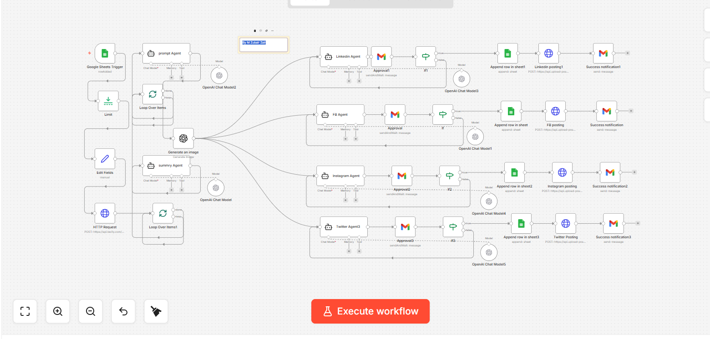

# AI-Powered Multi-Platform Content Creation & Social Media Automation System

## Overview
This project is an advanced automation system designed to manage the entire content lifecycle. It transforms a single topic into a fully researched post, complete with AI-generated visuals and platform-optimized captions, and publishes it automatically across multiple social media channels using n8n and Agentic AI.

## The Challenge
Businesses and content creators spend significant time researching topics, writing content, designing visuals, creating platform-specific captions, and manually publishing posts. Maintaining a consistent content strategy often requires a dedicated team and involves significant manual effort, leading to inconsistent posting schedules and operational burnout.

## The Solution
This AI-powered automation agent streamlines the entire content marketing workflow. It acts as a virtual marketing assistant that handles everything from research to publication, ensuring a consistent brand presence across all major social media platforms.

## Key Features
* Topic Intake: Processes content topics directly via Google Sheets.
* Intelligent Research: Automatically researches provided topics using AI and online information sources.
* Content Generation: Produces high-quality, relevant content tailored to the specific topic.
* AI Visuals: Creates context-aware AI-generated images for each post.
* Platform Optimization: Generates specific, optimized captions for LinkedIn, Facebook, Instagram, and X (Twitter).
* Auto-Publishing: Handles the scheduling and publication across all integrated platforms automatically.
* Logging: Maintains content records and publishing logs for performance tracking.

## Tech Stack
* Automation Platform: n8n
* AI Engine: OpenAI API
* Integrations: Google Sheets, LinkedIn API, Facebook API, Instagram API, X (Twitter) API
* Core Concepts: Content Automation, Workflow Automation, Marketing Automation

## Workflow Architecture

## Business Impact
* 90% Efficiency Gain: Drastically reduces content creation and publishing time.
* Operational Scale: Enables businesses to scale content marketing efforts without increasing team size.
* Consistency: Ensures a 24/7 consistent social media presence across multiple platforms.
* Productivity: Eliminates repetitive marketing tasks, allowing focus on high-level strategy.

## Setup Instructions
1. Download the social-media-automation.json file from this repository.
2. Import the file into your n8n dashboard.
3. Configure the required API credentials for OpenAI, Google Sheets, and your specific social media platforms (LinkedIn, Facebook, Instagram, X).
4. Activate the workflow to start automating your multi-platform content strategy.

## Important Security Note:
"For security reasons, this JSON file does not include pre-configured credentials. To run this workflow, you must connect your own OpenAI API Key, Google Service Account/OAuth, and CRM credentials within your n8n instance under the 'Credentials' settings."
